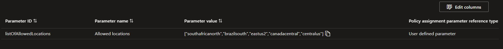

# 🗄️ VideoCore DB

<div align="center">

Provisionamento e gerenciamento de banco de dados Azure Cosmos DB para o ecossistema VideoCore. Desenvolvido como parte do curso de Arquitetura de Software da FIAP (Hackaton).

</div>

<div align="center">
  <a href="#visao-geral">Visão Geral</a> •
  <a href="#sytem-design">System Design</a> •
  <a href="#repositorios">Repositórios</a> •
  <a href="#estrutura">Estrutura</a> •
  <a href="#terraform">Terraform</a> •
  <a href="#tecnologias">Tecnologias</a> •
  <a href="#infra">Infraestrutura</a> •
  <a href="#modelo-relacional">Diagramas</a> •
  <a href="#justificativa">Justificativas</a> •
  <a href="#debitos-tecnicos">Débitos Técnicos</a> •
  <a href="#deploy">Fluxo de Deploy</a> •
  <a href="#instalacao">Instalação</a> •
  <a href="#contribuicao">Contribuição</a>
</div><br>

> 📽️ Vídeo de demonstração da arquitetura: [https://youtu.be/k3XbPRxmjCw](https://youtu.be/k3XbPRxmjCw)<br>

---

<h2 id="visao-geral">📋 Visão Geral</h2>

<details>
<summary>Expandir para mais detalhes</summary>

O **VideoCore DB** é o repositório responsável por provisionar a infraestrutura de banco de dados do sistema VideoCore, utilizando **Azure Cosmos DB (NoSQL)** como engine principal para persistência de relatórios de processamento de vídeo.

### Principais Responsabilidades

- **Provisionamento**: Criação e configuração do Azure Cosmos DB via Terraform
- **Rede**: Configuração de VNet e subnet dedicada para o banco de dados
- **Alta Disponibilidade**: Failover automático para região secundária
- **Desenvolvimento Local**: Emulador do Cosmos DB via Docker

### Bancos de Dados

| Microsserviço | Banco | Tipo |
|---------------|-------|------|
| **videocore-reports** | Azure CosmosDB | NoSQL (Document) |
| **videocore-worker** | Nenhum | Nenhum |
| **videocore-notification** | Nenhum | Nenhum |

### Estratégia de Persistência

**Azure Cosmos DB** é utilizado no domínio de reportes, priorizando **escalabilidade elástica**, **alta disponibilidade**, **flexibilidade de esquema** e leitura otimizada **(schema desnormalizado)**

</details>
  
---

<h2 id="sytem-design">🧠 System Design</h2>

<details>
<summary>Expandir para mais detalhes</summary>


### Key Points

- Arquitetura de Microsserviços + Arquitetura Orientada a Eventos `(EDA)`;
- Comunicação assíncrona entre todos os microsserviços, maximizando a resiliência e evitando a necessidade de implementação de `Circuit Breakers`, gerenciamento de `Timeout` ou `Retries` por parte do cliente;
  - O processamento do vídeo é assegurado pelo `Azure Service Bus`.
- Utilização de `Pre-Signed URLs` para upload/download dos vídeos, removendo a responsabilidade de gerenciamento disto pelos microsserviços, além de reduzir gastos no `APIM`. Agora eles apenas geram as `URLs`;
- Utilização do `Blob Storage`, solução de armazenamento de objetos em nuvem, para persistência dos vídeos e das imagens, eliminando a necessidade de salvar isto em bancos de dados relacionais ou não relacionais;
  - Permite a configuração de políticas de `Tiering` automático para redução de custos.
- Fluxo de encaminhamento do vídeo para processamento até os microsserviços 100% gerenciado pela `Microsoft`, utilizando soluções `PaaS` `Serverless`, via `Azure Storage Account` + `Azure Event Grid` + `Azure Service Bus`. Removendo a responsabilidade de gerenciarmos de forma autônoma escalabilidade e HA;
  - Mesmo que nenhum microsserviço esteja saudável no momento, o evento permanece na fila.
- Utilização do `KEDA` para scaling horizontal dos pods do microsserviço `worker`, responsável pelo processamento efetivo do vídeo, via `Ffmpeg`, com base no número de eventos da fila `process.queue`;
  - Os demais Pods também possuem scaling horizontal, mas via `HPA` nativo;
  - O scaling horizontal dos PODs juntamente dos pontos mencionados anteriormente viabilizam o envio de múltiplos vídeos simultâneamente.
- Utilização do padrão `SAGA Coreografado` para implementação de transações que abragem mais de um microsserviço;
- Utilização de `CDN` para entrega rápida a aplicação SPA escrita em `NEXT`;
- Utilização de banco de dados `(Azure Cosmos DB)` desnormalizado  para rápida consulta `(CQRS)`;
- Disparo de notificações em tempo real e via e-mail;
  - Via e-mail utilizasse o  `SMTP` `(Azure Send Grid)`, removendo a responsabilidade de manutenir de forma autônoma um servidor de envio de e-mails, em termos de escalabilidade e HA;
  - Em tempo real utilizasse um endpoint `WebSocket`, através do protocolo `STOMP`, exposto por um dos microsservços.
- Utilização de Ingress via `Azure Application Gateway (LB Layer 7)` para acesso aos PODs dos microsserviços, configurado via `AKS AGIC`;
- Utilização de um Azure Key Vault para consumo de secrets, via `AKS Azure Key Vault Provider`;
- Segurança, Caching e Rate Limiting garantidos pelo `APIM`, que por sua vez também é `Serverless`;
  - Segurança se dá através de `Inbound Policies` que orquestram comunicação com uma `Azure Function Authorizer`, que por sua vez dialoga com o `Cognito`.
- Observabilidade (Tracing, métricas e logging) com `New Relic` e `Open Telemetry`;
- Comunicação privada entre serviços da arquitetura, expondo somente o necessário (vide limitações de assinatura).

</details>

---

<h2 id="repositorios">📁 Repositórios do Ecossistema</h2>

<details>
<summary>Expandir para mais detalhes</summary>

| Repositório | Responsabilidade | Tecnologias |
|-------------|------------------|-------------|
| **videocore-infra** | Infraestrutura base | Terraform, Azure, AWS |
| **videocore-db** | Banco de dados | Terraform, Azure Cosmos DB |
| **videocore-auth** | Microsserviço de autenticação | C#, .NET 9, ASP.NET |
| **videocore-reports** | Microsserviço de relatórios | Java 25, GraalVM, Spring Boot 4, Cosmos DB |
| **videocore-worker** | Microsserviço de processamento de vídeo | Java 25, GraalVM, Spring Boot 4, FFmpeg |
| **videocore-notification** | Microsserviço de notificações | Java 25, GraalVM, Spring Boot 4, SMTP |
| **videocore-frontend** | Interface web do usuário | Next.js 16, React 19, TypeScript |

</details>

---

<h2 id="estrutura">📦 Estrutura do Projeto</h2>

<details>
<summary>Expandir para mais detalhes</summary>

```text
videocore-db/
├── terraform/
│   ├── main.tf              # Orquestração dos módulos
│   ├── variables.tf          # Variáveis de configuração
│   ├── datasources.tf        # Data sources remotos
│   ├── backend.tf            # Estado remoto (Azure Storage)
│   └── modules/
│       ├── vnet/             # Rede virtual
│       └── azure_cosmos_db_reports/  # Cosmos DB
├── docker/
│   ├── docker-compose.yml    # Emulador Cosmos DB
│   └── env-example           # Variáveis de ambiente
├── docs/                     # Assets de documentação
│              
└── scripts/
    ├── infra-up.sh           # Subir ambiente local
    ├── infra-down.sh         # Derrubar ambiente
    └── infra-restart.sh      # Reiniciar ambiente
```

</details>

---

<h2 id="terraform">🗄️ Módulos Terraform</h2>

<details>
<summary>Expandir para mais detalhes</summary>

O código `HCL` desenvolvido segue uma estrutura modular:

| Módulo | Descrição |
|--------|-----------|
| **azure_cosmos_db_reports** | Azure Cosmos DB |
| **vnet** | Topologia de rede referente ao banco de dados |

### Recursos Delegados pelo Repo de Infra

- Subnet delegada para banco de dados
- Zona de DNS privada
- VNET principal

> ⚠️ Os outpus criados são consumidos posteriormente em pipelines via `$GITHUB_OUTPUT` ou `Terraform Remote State`, para compartilhamento de informações. Tornando, desta forma, dinãmico o provisionamento da infraestrutura.

</details>

---

<h2 id="tecnologias">🔧 Tecnologias</h2>

<details>
<summary>Expandir para mais detalhes</summary>

| Categoria | Tecnologia |
|-----------|------------|
| **IaC** | Terraform |
| **Banco de Dados** | Azure Cosmos DB (NoSQL) |
| **Rede** | Azure VNet, Private Endpoint, Private DNS |
| **Emulação** | Azure Cosmos DB Linux Emulator (Docker) |
| **CI/CD** | GitHub Actions |
| **Cloud** | Microsoft Azure |

</details>

---

<h2 id="infra">🌐 Infraestrutura</h2>

<details>
<summary>Expandir para mais detalhes</summary>

### Topologia de Rede (10.0.0.0/24)

| Subnet | CIDR | Função |
|--------|------|--------|
| **Cosmos DB** | 10.0.7.0/24 | Azure Cosmos DB |

### Localização

- **Azure**: Recursos criados na região **Brazil South**, para menor latência
  
### Performance

- Todos os recursos foram provisionados buscando alta disponibilidade, recuperação de desastres e auto-scaling horizontal (vide limitações de assinatura)

### Segurança

- Apenas os recursos necesários foram expostos para a internet, neste caso, nenhum (vide limitações de assinatura)
- **NSG**: Para controle granular de tráfego de rede a nível de recurso

### HA/DR

- Todos os recursos foram provisionados buscando redundância zonal e backup geográfico (vide limitações de assinatura)

</details>

---

<h2 id="modelo-relacional">📊 Diagramas</h2>

<details>
<summary>Expandir para mais detalhes</summary>

### Modelo de Dados

#### Reports


> ℹ️ Partition Key: `UserId`
>
> O atributo `UserId` foi escolhido como chave de partição em decorrência de sua alta cardinalidade, evitando assim `Hot Partitions`.

> ⚠️ De acordo com nossa modelagem apenas o microsserviço de reportes necessita de um banco de dados. Todavia, entendemos de que conforme a aplicação evolua, os demais podem vir a ter os seus próprios, principalmente se padrões de resiliência como `Transactional Outbox Pattern` sejam adotados.
>
> Neste caso, entendemos também de que cada microsserviço é independente e não deve se comunicar com o outro diretamente via banco de dados, além de que diferentes microsserviços podem utilizar diferentes bancos de dados (independência tecnológica).

</details>

---

<h2 id="justificativa">❓ Justificativas de escolha</h2>

<details>
<summary>Expandir para mais detalhes</summary>

`Azure Cosmos DB (NoSQL)` foi adotado para **Reports** por sua flexibilidade e escalabilidade nativa.

#### Reports (Azure Cosmos DB)

- Escalabilidade e Disponibilidade:
  - Reports pode sofrer picos imprevisíveis de uso.
  - O Cosmos DB oferece escalabilidade elástica e SLA de **99,999%**, reduzindo riscos no consumo de eventos de atualização do status de processamento de um vídeo.

- Modelo de Dados Flexível:
  - Eventos de processamento de vídeo podem variar no futuro. Por exemplo, um evento de "upload concluído" pode ter metadados diferentes de um "erro de transcodificação". O `Cosmos DB` permite armazenar esses diferentes esquemas no mesmo container sem migrações complexas de `Schema`;
  - A desnormalização é encorajada. Isso elimina a necessidade de JOINs custosos no momento da consulta, permitindo que o status atual e o histórico sejam recuperados em uma única operação de leitura, aumentando a performance, indo de encontro com o `CQRS`.

- Distribuição Global:
  - Suporte nativo à replicação multi-região.
  - Facilita expansão internacional e adequação a legislações de soberania de dados.

> ℹ️ Combinação Teorema `PACELC` esperada: **P:A / E:L**
>
> Prioriza-se a Disponibilidade sobre a Consistência Forte (Eventual Consistency), garantindo que o usuário sempre veja algo, mesmo que o dado tenha acabado de ser processado

</details>

---

<h2 id="debitos-tecnicos">⚠️ Débitos Técnicos</h2>

<details>
<summary>Expandir para mais detalhes</summary>

### 💲 Observações sobre Custos

Alguns recursos foram implementados com downgrade ou comentados devido ao alto custo ou limitações da assinatura `Azure For Students`:

- **HA/ZRS**: Desabilitado por limitações de assinatura

A infraestrutura ideal foi implementada, com alguns trechos comentados para viabilizar o desenvolvimento sem esgotar créditos.

## Regiões Permitidas

A assinatura **Azure For Students** impõe restrições de Policy que limitam a criação de recursos às seguintes regiões:



</details>

---

<h2 id="deploy">⚙️ Fluxo de Deploy</h2>

<details>
<summary>Expandir para mais detalhes</summary>

### Pipeline

1. **Pull Request** → CI: Terraform Format, Validate e Plan
2. **Revisão e Aprovação** → Mínimo 1 aprovação de CODEOWNER
3. **Merge para Main** → CD: Terraform Apply

### Autenticação das Pipelines

- **Azure:**
  - **OIDC**: Token emitido pelo GitHub
  - **Azure AD Federation**: Confia no emissor GitHub
  - **Service Principal**: Autentica sem secret

### Ordem de Provisionamento

```text
1. videocore-infra          (AKS, VNET, APIM, etc)
2. videocore-db             (Cosmos DB)
3. videocore-auth           (Microsserviço de autenticação)
4. videocore-reports        (Microsserviço de relatórios)
5. videocore-worker         (Microsserviço de processamento)
6. videocore-notification   (Microsserviço de notificações)
7. videocore-frontend       (Aplicação SPA Web)
```

### Proteções

- Branch `main` protegida
- Nenhum push direto permitido
- Todos os checks devem passar

</details>

---

<h2 id="instalacao">🚀 Instalação e Uso</h2>

<details>
<summary>Expandir para mais detalhes</summary>

### Desenvolvimento Local

```bash
# Clonar repositório
git clone https://github.com/FIAP-SOAT-TECH-TEAM/videocore-db.git
cd videocore-db

# Configurar variáveis de ambiente
cp docker/env-example docker/.env

# Subir serviços de banco de dados (Cosmos DB Emulator)
./video start:infra
```

> ⚠️ Cosmos DB emulator pode ser acessado pelas aplicações de duas maneiras: modo `GATEWAY` e `DIRECT`. No primeiro, as operações de `CRUD` são realizadas via `API REST`, no segundo, diretamente via `TCP`.
>
> Embora os microsserviços o acessem via `DIRECT`, a SDK do `Azure` ainda aciona alguma de suas APIs para, por exemplo, identificar a lista de nós disponíveis.
>
> O `Cosmos DB Emulator` expõe endpoints `HTTPs` utilizando um certificado `(CA)` auto assinado. Portanto, para que as `JVMs` ou `Subtrate VMs` confiem nele é necessário adicioná-lo em sua `Truststore`. Para isto, basta seguir os passos explanados no `STDOUT` do comando `start:infra`.

</details>

---

<h2 id="contribuicao">🤝 Contribuição</h2>

<details>
<summary>Expandir para mais detalhes</summary>

### Fluxo de Contribuição

1. Crie uma branch a partir de `main`
2. Implemente suas alterações
3. Abra um Pull Request
4. Aguarde aprovação de um CODEOWNER

### Licença

Este projeto está licenciado sob a [MIT License](LICENSE).

</details>

---

<div align="center">
  <strong>FIAP - Pós-graduação em Arquitetura de Software</strong><br>
  Hackaton (Tech Challenge 5)
</div>